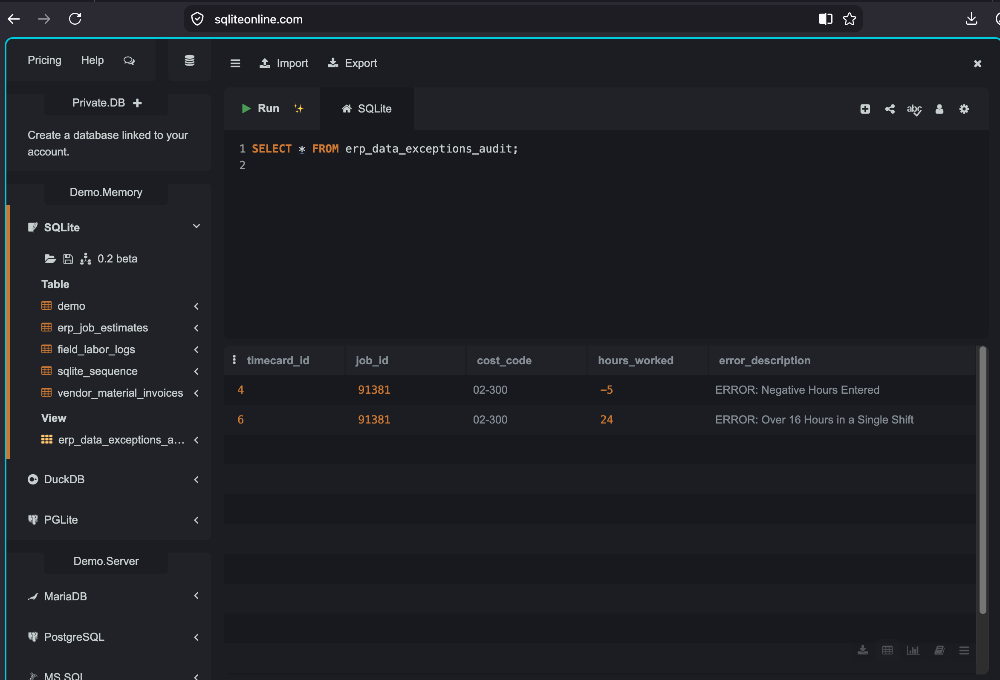

# Construction ERP Job-Costing Data Sandbox (SQLite)

## Project Overview
I built this relational database sandbox to model the backend data architecture of construction and field-service ERP systems (such as Viewpoint Vista or Sage 300 CRE). 

My goal was to practice mapping front-end mobile field labor logs and accounts payable vendor invoices into a centralized project accounting ledger to calculate job cost variances and establish defensive data validation protocols.

## My Development Sequence & Logic Iteration
1. **Schema Design:** I created three tables linking project estimates, field labor logs, and supplier invoices using standard primary and composite keys.
2. **The Logic Hurdle:** I initially built an audit view to flag human entry errors where daily entries exceeded 16 hours (`hours_worked > 16`). However, because my baseline test records represented accumulated weekly logs (`40, 40, 35`), my query unexpectedly flagged those valid rows as exceptions.
3. **The Production Fix:** I recalibrated the view using a conditional `CASE` statement and `OR` logic. This updated rule dynamically leaves standard weekly accumulations clear while perfectly trapping true human data-entry anomalies (such as a negative `-5` entry or an extreme single-shift overrun typo of `24` hours).

## System Architecture Modeled
* **`erp_job_estimates`**: Models corporate budgeting parameters, defining project cost codes and baseline allocations.
* **`field_labor_logs`**: Simulates live operational mobile field app data payloads (such as crew timecard entries sent from trucks).
* **`vendor_material_invoices`**: Represents supply-chain accounts payable records linked to the job.
* **`erp_data_exceptions_audit`**: An automated database validation view designed to isolate and flag human input anomalies for strict data integrity control.

## SQL Operations Practiced
* Multi-module Relational Schema Design & Composite Keys
* Complex Data Aggregation Querying (`LEFT JOIN`, `SUM`, `GROUP BY`)
* Operational Cost Center Variance Calculation Layouts
* Algorithmic Data Governance & Exception Auditing Frameworks

### My Live System Audit Output Dashboard

